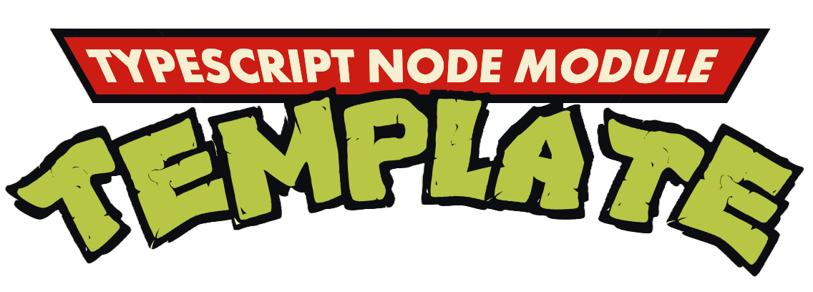

Sample node module template by Tib0. Shipped with:
- [x] Github's actions
- [x] VSCode config
- [x] Node config
- [x] TypeScript
- [x] Prettier
- [x] Eslint
- [x] Tsup 
- [x] Pnpm
- [x] Jest

# USE
Follow these steps to make it yours :

1. Clone the repository :
```sh
git clone https://github.com/tib0/typescript-node-module-template.git
```

2. Update package.json entries (author, name...)
```sh
code typescript-node-module-template\package.json
```

3. Rename folder `typescript-node-module-template` to whatever suit your needs.
```sh
mv typescript-node-module-template\ <target name>\
```

4. Remove git history :
```sh
rm -rf .git && git init && git add . && git commit -m "Initial commit"
```

5. Push :
```sh
git push
```

# WARNING
Warning triggered when using eslint in version 9.1.1 due to unmet dependency, I had to downgrade to eslint@8.56.0. It avoids using two versions of the same dependency. 

Warning seen:
> "eslint": "^9.1.1" cause WARN  Issues with peer dependencies found
```txt
.
├─┬ @typescript-eslint/eslint-plugin 7.7.1
│ ├── ✕ unmet peer eslint@^8.56.0: found 9.1.1
│ └─┬ @typescript-eslint/type-utils 7.7.1
│   ├── ✕ unmet peer eslint@^8.56.0: found 9.1.1
│   └─┬ @typescript-eslint/utils 7.7.1
│     └── ✕ unmet peer eslint@^8.56.0: found 9.1.1
└─┬ @typescript-eslint/parser 7.7.1
  └── ✕ unmet peer eslint@^8.56.0: found 9.1.1
```